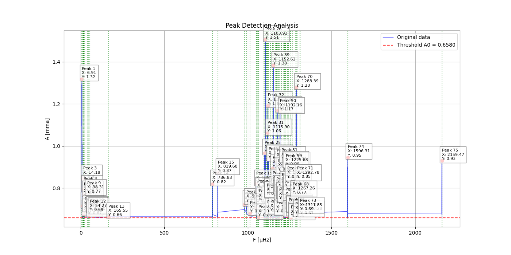

# Max

(.max) File Reader and Sorter

This is a short python program that helps you sort out the useful lines in your max file. Below are a few lines of code for when you run this program on a Linux terminal, simply to clean the table and make it more accessible.

The original max file might have more columns than needed, as well as blank spaces.

Use this line of code to get rid of the blank spaces:

```bash
sed -i 's/^[ \t]*//' example.max
```

Use this line of code to remove whichever line you'd like:

```bash
awk '{$2=""; $0=$0; print}' example.max > tmp && mv tmp example.max
```

Notice that this example only removes column 2. If you're interested in backing up the file first, then use:

```bash
cp example.max backup-example.max
```

## Parameters

Call max.py on your terminal

```bash
python max.py
```

- Data file: example.max  
- X Column: **0** [muHz]
- Y Column: **2** [mma] (if you keep the period column in the original file, otherwise use 1)  
- Threshold A0 value [fap]: 0.658
- Minimum peak width (default 0.1) [fap]: 0.658

And follow the exact same steps for the .fmax file.

## Results

The program will generate both a graph and a table simultaneously, so you can compare the results.




You can search through the table based on the "Y Max" and "X Max" columns and compare the results with example.max to make sure they match. The generated table displays 3 decimal numbers, unlike the original file, so mind the roundings.
